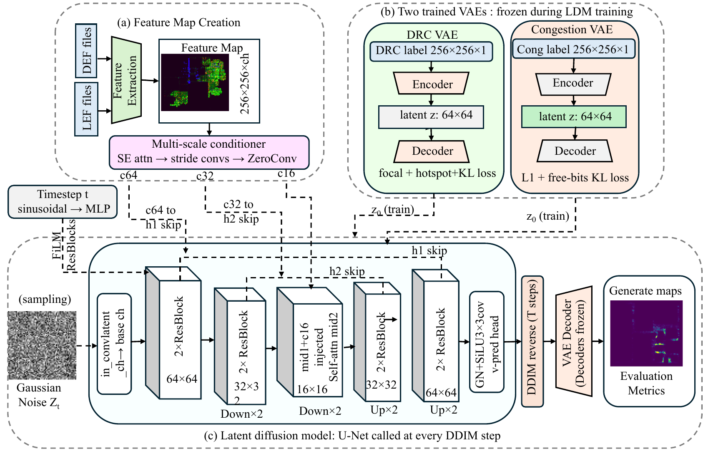

<div align="center">

# CLDRoute

### Conditional Latent Diffusion for Routability Map Generation in Physical Design

[](https://iccad.com)
[](LICENSE)
[](https://huggingface.co/kiranthorat/CLDRoute)
[](https://huggingface.co/datasets/kiranthorat/CLDRoute-dataset)

**Accepted at ICCAD 2026**

</div>

---

## Abstract

Accurate routability estimation during physical design is important for reducing costly post-routing iterations. Prior learning-based methods treat this task as deterministic prediction, mapping placement-stage features to a single congestion or DRC outcome. We instead formulate routability estimation as a *conditional generation* problem, where both routing congestion and DRC violations are modeled as spatially structured *routability fields*.

Our framework, **C**onditional **L**atent **D**iffusion for **Route**ability estimation (**CLDRoute**), uses physics-aware conditioning and task-specific latent modeling to handle the different characteristics of congestion and DRC maps. This allows our method to support sample-based inference, producing both a mean prediction and a spatial uncertainty estimate for the same input design.

On CircuitNet 2.0 (N28), CLDRoute achieves for DRC violation generation an SSIM of **0.9678**, MAE of **0.0028**, and TopK@1% of **0.3494**; for congestion generation an SSIM of **0.9031**, MAE of **0.0286**, and NZ-Pearson of **0.3692**. Overall, our framework provides a more practical view of routability at placement by generating both the expected outcome and its uncertainty.

---

## Framework Overview



CLDRoute is a two-stage pipeline:

1. **Task-specific VAE** — DRC maps (95% zeros, sparse) and congestion maps (99.8% active, dense) are encoded into separate latent spaces: **12×64×64** for DRC (focal loss γ=20 + hotspot MSE, β=0.05) and **8×64×64** for congestion (L1 + free-bits KL λ=0.5, β=0.005).

2. **Conditional LDM** — A U-Net denoises in latent space over T=1000 cosine DDIM steps. Physics-aware routing control features (demand · supply · geometry) are injected at three spatial scales (64×64, 32×32, 16×16) via multi-scale ControlNet + ZeroConv. **N=8 samples** at inference yield a mean map and a per-pixel uncertainty map.

---

## Results

All metrics averaged over **3 seeds** {1234, 2345, 3456}, **N=8 DDIM samples**, η=0.

### N28 — DRC Violation Map

| Method | MAE ↓ | SSIM ↑ | Pearson ↑ | TopK@1% ↑ | F1@0.1 ↑ | Uncertainty |
|--------|-------:|-------:|----------:|----------:|---------:|------------:|
| Pixel Diffusion (9 ch) | 0.01961 | 0.5927 | 0.2899 | 0.2207 | 0.1537 | 0.7835 |
| LDM (15 ch) | 0.00292 | 0.9647 | 0.5048 | 0.3384 | 0.4025 | 0.5954 |
| **LDM + ControlNet (15 ch)** | **0.00280** | **0.9678** | **0.5248** | **0.3494** | **0.4420** | 0.5735 |

### N28 — Congestion Map

| Method | MAE ↓ | SSIM ↑ | Pearson ↑ | NZ-Pearson ↑ | Spatial Bias | Uncertainty |
|--------|-------:|-------:|----------:|-------------:|-------------:|------------:|
| Pixel Diffusion (3 ch) | 0.02730 | 0.9199 | 0.3077 | 0.3088 | 0.0071 | 0.2411 |
| LDM (10 ch) | 0.02915 | 0.9122 | 0.3313 | 0.3317 | −0.0126 | 0.2123 |
| **LDM + ControlNet (10 ch)** | **0.02859** | **0.9031** | **0.3687** | **0.3692** | **−0.0044** | **0.3592** |

### N14

| Task | Best method | MAE ↓ | SSIM ↑ | TopK@1% ↑ | Pearson ↑ |
|------|-------------|-------:|-------:|----------:|----------:|
| DRC | LDM | 0.00627 | 0.7136 | 0.0125 | 0.0874 (NZ) |
| Congestion | LDM | 0.03416 | 0.7678 | — | 0.0369 |

---

## Pretrained Models & Dataset

| Resource | Link | Size |
|----------|------|-----:|
| All checkpoints (VAE + LDM, N28 + N14) | [🤗 kiranthorat/CLDRoute](https://huggingface.co/kiranthorat/CLDRoute) | ~2.5 GB |
| Physics-aware routing features | [🤗 kiranthorat/CLDRoute-dataset](https://huggingface.co/datasets/kiranthorat/CLDRoute-dataset) | ~152 GB |

```bash
# Download checkpoints
python -c "
from huggingface_hub import snapshot_download
snapshot_download('kiranthorat/CLDRoute', local_dir='./ckpts')
"

# Download dataset
python -c "
from huggingface_hub import snapshot_download
snapshot_download(
    repo_id='kiranthorat/CLDRoute-dataset',
    repo_type='dataset',
    local_dir='./data/features'
)
"
```

**Checkpoint files:**

| File | Description |
|------|-------------|
| `checkpoints/n28/vae_DRC_best_ldm.pt` | N28 DRC VAE (35 MB) |
| `checkpoints/n28/vae_Cong_best_ldm.pt` | N28 Congestion VAE (35 MB) |
| `checkpoints/n28/ldm_DRC_control_best_gen.pt` | N28 LDM+ControlNet DRC (347 MB) |
| `checkpoints/n28/ldm_Cong_control_best_gen.pt` | N28 LDM+ControlNet Congestion (347 MB) |
| `checkpoints/n28/ldm_DRC_unified_best_gen.pt` | N28 LDM DRC — no ControlNet (327 MB) |
| `checkpoints/n28/ldm_Cong_unified_best_gen.pt` | N28 LDM Congestion — no ControlNet (327 MB) |
| `checkpoints/n14/` | N14 equivalents (same naming) |

---

## Reproducing Paper Results

### Setup

```bash
git clone https://github.com/kiranthorat3/CLDRoute.git
cd CLDRoute
pip install -r requirements.txt
# Tested: Python 3.10 · PyTorch 2.1 · CUDA 12.1 · NVIDIA A6000 48 GB
```

---

### Evaluate with pretrained checkpoints

**N28 DRC — Tables 7 & 8** (MAE=0.00280, SSIM=0.9678, TopK@1%=0.3494)

```bash
python src/ldm_control/latent_sampler.py \
    --ckpt      ./ckpts/checkpoints/n28/ldm_DRC_control_best_gen.pt \
    --vae_dir   ./ckpts/checkpoints/n28/vae_DRC_best_ldm.pt \
    --split     test  --steps 200  --eta 0.0  --cfg_scale 1.5 \
    --N 8  --seeds 1234 2345 3456  --out_dir ./results/drc_n28
```

**N28 Congestion — Tables 9 & 10** (MAE=0.02859, SSIM=0.9031, NZ-Pearson=0.3692)

```bash
python src/ldm_control/latent_sampler.py \
    --ckpt      ./ckpts/checkpoints/n28/ldm_Cong_control_best_gen.pt \
    --vae_dir   ./ckpts/checkpoints/n28/vae_Cong_best_ldm.pt \
    --split     test  --steps 100  --eta 0.0  --cfg_scale 0.0 \
    --N 8  --seeds 1234 2345 3456  --out_dir ./results/cong_n28
```

**N14 DRC — Table 11** (MAE=0.00627, SSIM=0.7136)

```bash
python src/n14/ldm_unified/latent_sampler.py \
    --ckpt      ./ckpts/checkpoints/n14/ldm_DRC_unified_best_gen.pt \
    --vae_dir   ./ckpts/checkpoints/n14/vae_DRC_best_ldm.pt \
    --split     test  --steps 200  --eta 0.0 \
    --N 8  --seeds 1234 2345 3456  --out_dir ./results/drc_n14
```

**N14 Congestion — Table 12** (MAE=0.03416, SSIM=0.7678)

```bash
python src/n14/ldm_unified/latent_sampler.py \
    --ckpt      ./ckpts/checkpoints/n14/ldm_Cong_unified_best_gen.pt \
    --vae_dir   ./ckpts/checkpoints/n14/vae_Cong_best_ldm.pt \
    --split     test  --steps 100  --eta 0.0 \
    --N 8  --seeds 1234 2345 3456  --out_dir ./results/cong_n14
```

---

### Train from scratch

> **Before LDM training:** set `_EXPANDED_ROOT` in `src/ldm_control/latent_config.py` (and `src/ldm_unified/latent_config.py`) to your local data path.

**Step 1 — Train DRC VAE** (~6 h, one A6000)

```bash
bash scripts/train/train_drc_vae_n28.sh \
    /path/to/CircuitNet-N28/training_set_expanded \
    ./runs/vae_DRC_N28
# Explicit: latent_ch=12, beta=0.05, free_bits=0.5, focal_gamma=20, epochs=150, bs=32, lr=1e-3
# Checkpoint: ./runs/vae_DRC_N28/best_ldm.pt
```

**Step 2 — Train Congestion VAE** (~6 h, one A6000)

```bash
bash scripts/train/train_cong_vae_n28.sh \
    /path/to/CircuitNet-N28/training_set_expanded \
    ./runs/vae_Cong_N28
# Explicit: latent_ch=8, beta=0.005, free_bits=0.5, epochs=150, bs=32, lr=1e-3
# Checkpoint: ./runs/vae_Cong_N28/best_ldm.pt
```

**Step 3 — Train LDM + ControlNet, DRC** (~10 h, one A6000)

```bash
bash scripts/train/train_ldm_drc_n28_control.sh \
    ./runs/vae_DRC_N28 \
    ./runs/ldm_DRC_N28_control
# Explicit: epochs=200, bs=16, lr=1e-4, cfg_drop=0.1, T=1000 cosine, v-pred, min-SNR γ=5
# Checkpoint: ./runs/ldm_DRC_N28_control/best_gen.pt
```

**Step 4 — Train LDM + ControlNet, Congestion** (~10 h, one A6000)

```bash
bash scripts/train/train_ldm_cong_n28_control.sh \
    ./runs/vae_Cong_N28 \
    ./runs/ldm_Cong_N28_control
# Checkpoint: ./runs/ldm_Cong_N28_control/best_gen.pt
```

N14 counterparts follow the same steps — see `scripts/train/train_*_n14_*.sh`.

---

## Repository Layout

```
CLDRoute/
├── src/
│   ├── drc_vae/            # N28 DRC VAE (vae_train.py, vae_model.py, ...)
│   ├── cong_vae/           # N28 Congestion VAE
│   ├── ldm_control/        # N28 LDM + ControlNet (latent_trainer.py, latent_sampler.py, ...)
│   ├── ldm_unified/        # N28 LDM without ControlNet
│   ├── baseline/           # Pixel-space diffusion baseline
│   └── n14/                # N14 counterparts (same structure)
├── scripts/
│   ├── train/              # 12 training shell scripts
│   └── eval/               # 8 evaluation shell scripts
├── data/splits/            # Train / val / test CSV splits (N28 and N14)
└── assets/                 # Paper figures (PDF)
```

---

## Citation

```bibtex
@inproceedings{cldroute2026,
  title     = {{CLDRoute}: Conditional Latent Diffusion for Routability Map
               Generation in Physical Design},
  booktitle = {Proceedings of the IEEE/ACM International Conference on
               Computer-Aided Design (ICCAD)},
  year      = {2026}
}
```

---

## Acknowledgements

We use the [CircuitNet 2.0](https://circuitnet.github.io/) dataset.
Diffusion backbone inspired by [LDM](https://github.com/CompVis/latent-diffusion) and [ControlNet](https://github.com/lllyasviel/ControlNet).
